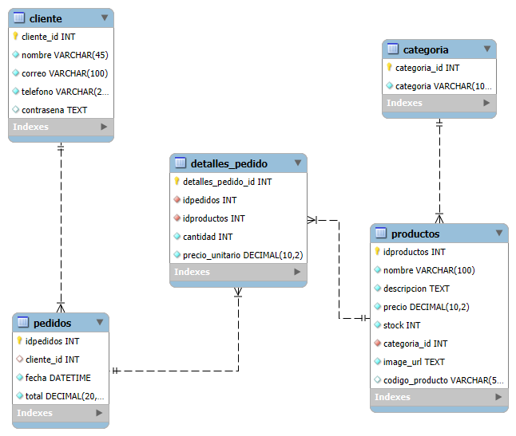

# Tienda - Plataforma de Comercio Electrónico

## Descripción General

Tienda es una plataforma de comercio electrónico de pila completa que permite a los usuarios navegar por un catálogo de productos, crear cuentas, gestionar carrito de compras y completar pedidos. La aplicación está construida con Laravel 12 en el backend y React 19 en el frontend, proporcionando una experiencia moderna, segura y altamente receptiva.

## Características Principales

- Catálogo de productos con filtrado por categoría y precio
- Sistema de autenticación de usuarios con registro y login
- Carrito de compras persistente en localStorage
- Gestión completa de pedidos
- Integración con mapas interactivos mediante Leaflet
- API RESTful con validación de entrada
- Base de datos relacional con integridad referencial
- Interfaz responsiva construida con React

## Requisitos del Sistema

- PHP 8.2 o superior
- Node.js 16 o superior
- Composer
- npm o yarn
- SQLite (predeterminado) o MySQL

## Estructura del Proyecto

```
tienda/
├── Backend/                 # API REST con Laravel 12
│   ├── app/
│   │   ├── Http/
│   │   │   └── Controllers/
│   │   │       ├── RegisterController.php
│   │   │       └── LoginController.php
│   │   └── Models/
│   │       ├── Producto.php
│   │       └── Categoria.php
│   ├── routes/
│   │   └── api.php
│   ├── database/
│   │   ├── migrations/
│   │   ├── seeders/
│   ├── config/
│   ├── storage/logs/
│   ├── composer.json
│   ├── package.json
│   └── .env.example
│
├── frontend/                # Interfaz con React 19
│   ├── src/
│   │   ├── components/
│   │   │   ├── catalogo.jsx
│   │   │   ├── carrito.jsx
│   │   │   ├── iniciar_sesion.jsx
│   │   │   ├── registrarse.jsx
│   │   │   ├── pedidos.jsx
│   │   │   ├── pago.jsx
│   │   │   ├── datosfinales.jsx
│   │   │   ├── vistacatalogo.jsx
│   │   │   ├── resumen.jsx
│   │   │   └── maps.jsx
│   │   ├── App.jsx
│   │   └── main.jsx
│   ├── package.json
│   ├── vite.config.js
│   └── index.html
│
└── README.md
```

## Instalación y Configuración Inicial

### Backend

```bash
cd Backend
php artisan key:generate
php artisan migrate
php artisan db:seed
```

### Frontend

```bash
cd frontend
npm install
```

## Ejecución del Proyecto

**Terminal 1 - Backend:**

```bash
cd Backend
php artisan serve
```

El servidor estará disponible en `http://localhost:8000`

**Terminal 2 - Frontend:**

```bash
cd frontend
npm run dev
```

El servidor estará disponible en `http://localhost:5173`

## Esquema de Base de Datos

### Diagrama Entidad-Relación



## API REST - Documentación de Endpoints

### Productos

#### GET `/api/inicio`

Retorna los 10 productos más económicos con mensaje de bienvenida.

**Respuesta:**

```json
{
  "mensaje": {
    "titulo": "Articulos que te pueden interesar"
  },
  "productos": [
    {
      "idproductos": 1,
      "codigo_producto": "PROD001",
      "nombre": "Laptop Dell",
      "descripcion": "Laptop de alto rendimiento",
      "precio": 899.99,
      "stock": 5,
      "categoria": "Laptops",
      "image_url": "url_imagen.jpg"
    }
  ]
}
```

#### GET `/api/catalogo`

Retorna todos los productos ordenados ascendentemente por ID.

#### GET `/api/catalogo/mayor`

Retorna todos los productos ordenados de mayor a menor precio.

#### GET `/api/catalogo/menor`

Retorna todos los productos ordenados de menor a mayor precio.

### Autenticación

#### POST `/api/register`

Registra un nuevo usuario en el sistema.

**Parámetros requeridos:**

```json
{
  "nombre": "Juan Perez",
  "correo": "juan@example.com",
  "telefono": "1234567890",
  "password": "password123"
}
```

**Validaciones:**

- nombre: requerido, máximo 45 caracteres
- correo: requerido, formato email válido, máximo 100 caracteres, único en la base de datos
- telefono: opcional, máximo 20 caracteres
- password: requerido, mínimo 6 caracteres

**Respuesta exitosa (201):**

```json
{
  "message": "Registro creado",
  "cliente_id": 1
}
```

**Respuesta error (422):**

```json
{
  "message": "El correo ya está registrado"
}
```

#### POST `/api/login`

Autentica un usuario existente.

**Parámetros requeridos:**

```json
{
  "correo": "juan@example.com",
  "password": "password123"
}
```

**Respuesta exitosa (200):**

```json
{
  "message": "Autenticado",
  "cliente_id": 1,
  "nombre": "Juan Perez",
  "correo": "juan@example.com",
  "telefono": "1234567890"
}
```

**Respuesta error (401):**

```json
{
  "message": "Credenciales inválidas"
}
```

### Pedidos

#### POST `/api/pedidos`

Crea un nuevo pedido en el sistema.

**Parámetros:**

```json
{
  "cliente_id": 1,
  "total": 1500.0
}
```

**Validaciones:**

- cliente_id: opcional, entero
- total: requerido, numérico

**Respuesta exitosa (201):**

```json
{
  "id": 1,
  "fecha": "2026-01-10 14:30:00"
}
```

#### POST `/api/pedidos/{id}/detalles`

Añade items de productos a un pedido existente.

**Parámetros:**

```json
{
  "items": [
    {
      "idproductos": 1,
      "cantidad": 2,
      "precio_unitario": 899.99
    },
    {
      "idproductos": 5,
      "cantidad": 1,
      "precio_unitario": 150.0
    }
  ]
}
```

**Validaciones:**

- items: requerido, array
- idproductos: requerido, entero
- cantidad: requerido, entero
- precio_unitario: requerido, numérico

**Respuesta exitosa (201):**

```json
{
  "inserted": 2
}
```

## Arquitectura Frontend

### Componentes Principales

**App.jsx** - Componente raíz

- Gestiona enrutamiento general
- Mantiene estado global del carrito
- Gestiona información del cliente autenticado
- Realiza llamadas iniciales a la API

**Catalogo.jsx** - Catálogo de productos

- Visualización en grid de productos
- Filtrado por categoría
- Ordenamiento por precio

**Vistacatalogo.jsx** - Detalle de producto

- Vista expandida de un producto
- Información completa y especificaciones
- Botón para agregar al carrito

**Carrito.jsx** - Gestor del carrito

- Visualización de items en el carrito
- Actualización de cantidades
- Cálculo de totales
- Proceder al pago

**IniciarSesion.jsx** - Formulario de login

- Validación de credenciales
- Autenticación de usuarios

**Registrarse.jsx** - Formulario de registro

- Creación de nuevas cuentas
- Validación de datos de entrada

**Pago.jsx** - Procesamiento de pago

- Interfaz de pago
  > - Resumen de compra

**Datosfinales.jsx** - Datos de envío

- Recolección de información de entrega
- Confirmación final

**Resumen.jsx** - Resumen del pedido

- Detalle completo del pedido
- Información de envío

**Maps.jsx** - Mapas interactivos

- Integración con Leaflet
- Selección de ubicación de entrega

### Gestión de Estado

El carrito se persiste en `localStorage` con la clave `cart` como un array de objetos:

```javascript
[
  {
    idproductos: 1,
    nombre: "Laptop Dell",
    precio: 899.99,
    cantidad: 2,
    image_url: "...",
  },
];
```

La información del cliente se mantiene en el estado de React durante la sesión activa.

Los datos de productos se cargan una única vez desde la API al iniciar la aplicación.

## Comandos Disponibles

### Backend

```bash
# Iniciar servidor de desarrollo (recomendado)
composer dev

# Iniciar solo el servidor PHP
php artisan serve

# Ejecutar pruebas unitarias
composer test

# Ejecutar linter PHP (Pint)
php artisan pint

# Acceder a la consola interactiva
php artisan tinker

# Limpiar caché de configuración
php artisan config:clear

# Ejecutar seeders de datos
php artisan db:seed
```

### Frontend

```bash
# Servidor de desarrollo con Vite
npm run dev

# Compilar para producción
npm run build

# Verificar código con ESLint
npm run lint

# Vista previa de la compilación de producción
npm run preview
```

## Consideraciones de Seguridad

- Las contraseñas se hashean con el algoritmo BCRYPT (12 rondas)
- Validación estricta de entrada en todos los endpoints
- CORS configurado para las solicitudes del frontend
- Validación de tipos en los modelos Eloquent
- Manejo de excepciones con logging detallado
- Detección automática del nombre de columna de contraseña para compatibilidad
- Las credenciales inválidas retornan mensajes genéricos sin revelar detalles

## Flujo de Usuario

1. Usuario accede a la aplicación y ve el catálogo con productos destacados
2. Navega por categorías: Memoria Ram, Laptops, Periféricos, Monitores, Almacenamiento, Audio
3. Filtra productos por precio (ascendente o descendente)
4. Agrega productos al carrito
5. Si es nuevo usuario, se registra con sus datos
6. Si es usuario existente, inicia sesión
7. Revisa el contenido del carrito y procede al pago
8. Ingresa datos de envío finales
9. Visualiza el resumen de la compra
10. Completa el pedido y se registra en la base de datos

### Video de Ejemplo

En el siguiente video se presenta una demostración completa del flujo de usuario, mostrando todos los pasos desde la navegación por el catálogo, selección de productos, gestión del carrito, autenticación y finalización del pedido.

[Visualizar demostración en Google Drive](https://drive.google.com/file/d/1nXtFic5Xpg8uRRhwrmYA3QkHc7LRZNSj/view?usp=sharing)

## Stack Tecnológico

### Backend

| Tecnología        | Versión | Propósito           |
| ----------------- | ------- | ------------------- |
| Laravel Framework | 12.0    | Framework principal |
| PHP               | 8.2+    | Lenguaje base       |
| MySQL             | -       | Base de datos       |
| PHPUnit           | 11.5.3  | Testing             |
| Pint              | 1.13    | Linter PHP          |
| Laravel Tinker    | 2.10.1  | REPL interactivo    |

### Frontend

| Tecnología   | Versión | Propósito          |
| ------------ | ------- | ------------------ |
| React        | 19.1.0  | Framework UI       |
| React Router | 7.8.2   | Enrutamiento       |
| Vite         | 7.0.4   | Build tool         |
| Leaflet      | 1.9.4   | Mapas interactivos |
| ESLint       | 9.30.1  | Linter JavaScript  |

## Notas de Desarrollo

- La aplicación detecta automáticamente el nombre de la columna de contraseña en la tabla cliente para mayor flexibilidad
- Los archivos de log se almacenan en `Backend/storage/logs/`
- El carrito del usuario se persiste automáticamente en el navegador mediante localStorage
- Se utiliza MYSQL para facilitar la configuración local
- Cada componente React incluye su propio archivo CSS asociado

## Resolución de Problemas Comunes

**Error: "composer: command not found"**

- Descargar Composer desde https://getcomposer.org

**Error: "npm: command not found"**

- Descargar Node.js desde https://nodejs.org

**Error: "php artisan serve" no funciona**

- Verificar que PHP 8.2+ esté instalado: `php --version`
- En Windows, asegurar que PHP esté en el PATH del sistema

**Carrito no persiste**

- Verificar que localStorage esté habilitado en el navegador
- Revisar que no haya restricciones de privacidad bloqueando localStorage

**API no responde desde el frontend**

- Verificar que el servidor Backend está corriendo en puerto 8000
- Revisar la consola del navegador para errores CORS

## Referencias Documentales

- [Laravel Documentation](https://laravel.com/docs)
- [React Documentation](https://react.dev)
- [Vite Documentation](https://vite.dev)
- [Leaflet Documentation](https://leafletjs.com)
- [MySQL Documentation](https://dev.mysql.com/doc)

## Licencia

Este proyecto está licenciado bajo la Licencia MIT.
